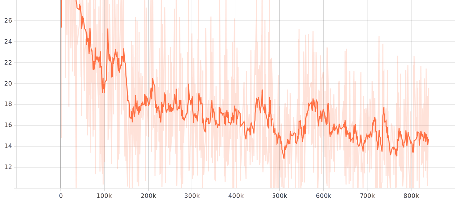
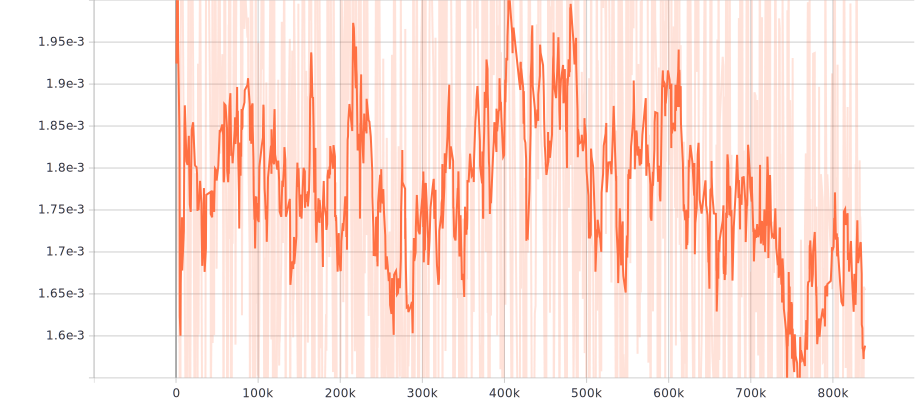
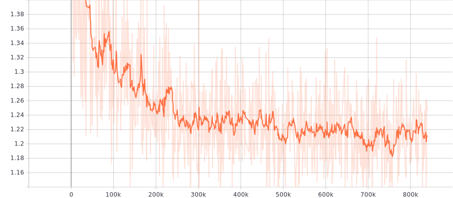
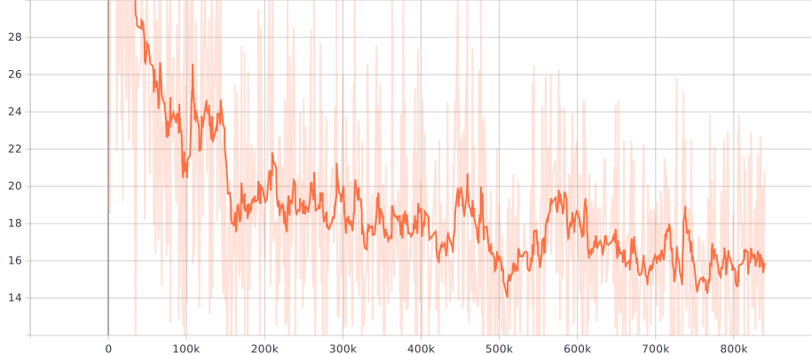
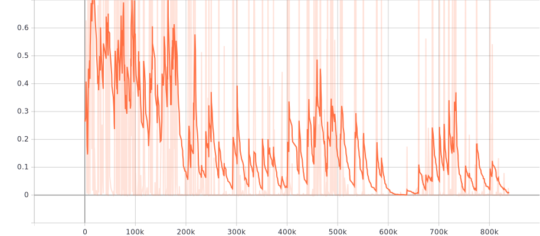

# Talking_Heads

## Description
This project is a Tensorflow implementation of [Few-Shot Adversarial Learning of Realistic Neural Talking Head Models]
(https://arxiv.org/pdf/1905.08233.pdf). In this paper, a GAN with a Embedder Network has been designed and trained 
to generate realistic talking head models from a K (only a few or just one) head-shots and the face landmarks.

Meta-learning stage has been implemented and training in progress, Few-shot learning / fine-tuning stage yet to be tested.

---

## Progress

###### Generator Output (*Org-ldmk-Gen*)

###### Adversarial Loss

###### Content Loss

###### Match Loss

###### Embedder&Generator Loss

###### Discriminator Loss

---

## References

### Paper References

* [Few-Shot Adversarial Learning of Realistic Neural Talking Head Models](https://arxiv.org/pdf/1905.08233.pdf)
* [LARGE SCALE GAN TRAINING FOR HIGH FIDELITY NATURAL IMAGE SYNTHESIS](https://arxiv.org/pdf/1809.11096.pdf)
* [Perceptual Losses for Real-Time Style Transfer and Super-Resolution](https://arxiv.org/pdf/1603.08155.pdf)
* [Arbitrary Style Transfer in Real-time with Adaptive Instance Normalization](https://arxiv.org/pdf/1703.06868.pdf)
* [SPECTRAL NORMALIZATION FOR GENERATIVE ADVERSARIAL NETWORKS](https://arxiv.org/pdf/1802.05957.pdf)
* [High-Resolution Image Synthesis and Semantic Manipulation with Conditional GANs](https://arxiv.org/pdf/1711.11585.pdf)

### Code References

* [https://github.com/grey-eye/talking-heads](https://github.com/grey-eye/talking-heads)
* [https://github.com/taki0112/BigGAN-Tensorflow](https://github.com/taki0112/BigGAN-Tensorflow)
